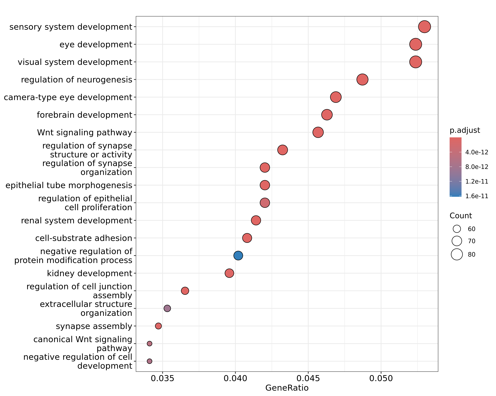
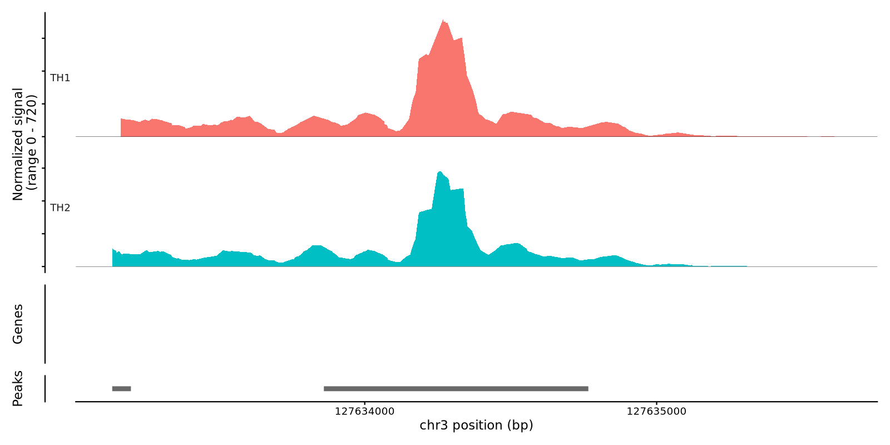
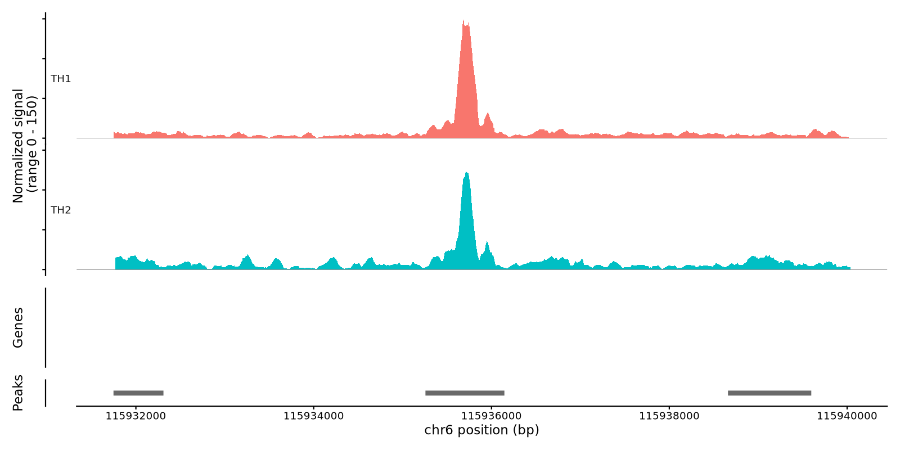
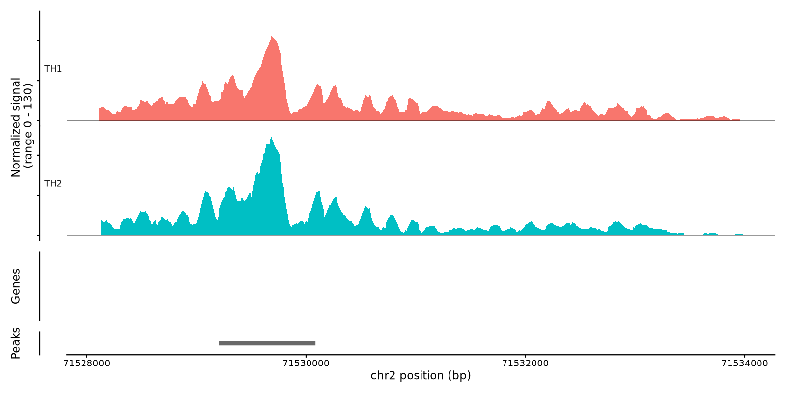
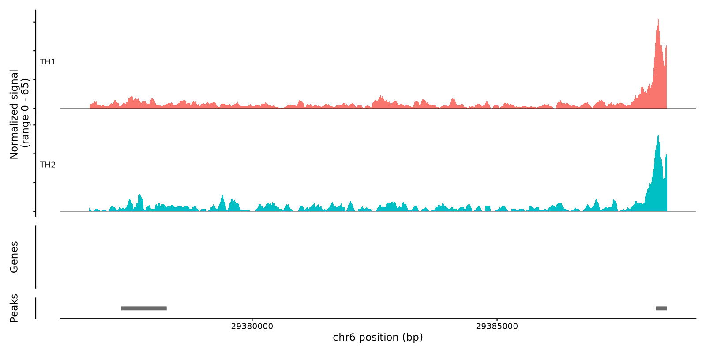
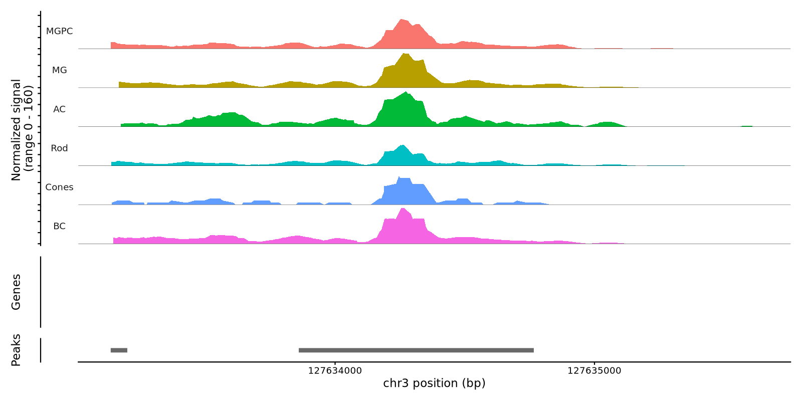

# Neurog2 Multiomics Using Seurat and Signac

```text
 _   _                            ____  
| \ | | ___ _   _ _ __ ___   __ _|___ \ 
|  \| |/ _ \ | | | '__/ _ \ / _` | __) |
| |\  |  __/ |_| | | | (_) | (_| |/ __/ 
|_| \_|\___|\__,_|_|  \___/ \__, |_____|
                            |___/       
```

Normally, adult mouse retinas cannot generate new neurons, so vision loss is permanent. We are testing whether overexpressing Neurog2 in Müller glia can reprogram them into functional retinal neurons. These newly formed neurons behave like normal retinal cells.

## Before filtering 


## After filtering 


## Umap 


## Samples are too seperated, we do harmony for batch effect 


## Remove cluster 11, 19, and 26 and reCluster 


### UMI per cluster for investigating poor cells


## Marker Genes feature  plots


  

  

  

  

  

  

  

  

  

  

  

  

  

  

  

  

  


## Annotation: 


## Cell ratio  


## Differential Gene Expression

#### Starting with: 

| Metric          | Count   |
|-----------------|---------|
| Number of cells | 17,278  |
| Number of genes | 32,287  |


```r
celltype_markers <- FindAllMarkers(
  myObject,
  assay = "SCT",
  only.pos = TRUE,
  min.pct = 0.1,
  logfc.threshold = 0.25,
  test.use = "wilcox",
  verbose = TRUE
)

``` 

# 📝📝📝📝 Download DGE 

#### Ascl1 exist chat not 

[Download DGE csv](https://docs.google.com/spreadsheets/d/14xipS-nTOasxoGZ4Ljx0jYxBgCW2svklyGPC1oQ7KPQ/edit?usp=sharing)


### Heatmap using `hPlot.R` script


# Differential Peaks

```
myObject.atac.markers <- FindAllMarkers(
  myObject,
  only.pos = TRUE,
  min.pct = 0.25,
  logfc.threshold = 0.25
)
``` 

#### Download unfiltered annotated Diffpeaks 

[All Annotated DiffPeaks](https://docs.google.com/spreadsheets/d/1SM759_168C0F-RcrduTf4zr1dbh4U2Ta_WPNwRQ0YlE/edit?usp=sharing)


#  Subset MG/MGPC 

## Differential gene expression in the MG/MGPC subset 

```r
dge_results <- FindMarkers(
  subset_cells,
  ident.1 = "TH2",
  ident.2 = "TH1",
  assay = "SCT",
  logfc.threshold = 0.25,
  test.use = "wilcox",
  min.pct = 0.1,
  )

``` 

 


## Download DGE for MG/MGPC subset 

[MG/MGPC DGE](https://docs.google.com/spreadsheets/d/17JkCb6IviAh6rUSZlV8lAQTN0331oyK8BmUCkgzcvnA/edit?usp=sharing)


## Differential Peaks in subset MG/MGPC 


## Download annotated MG/MGPC subset differential peaks

[MG/MGPC differential peaks](https://docs.google.com/spreadsheets/d/17LYiDVUW5CcdYlOw8LkqRCJfDMJGFKz0Wao67wdDOqE/edit?usp=sharing)


Neurog2 one close peak which has the following significance 
 
| Peak                     | p_val        | avg_log2FC | pct.1 | pct.2 | p_val_adj   |
| ------------------------ | ------------ | ---------- | ----- | ----- | ----------- |
| chr3-127633860-127634766 | 8.70 × 10⁻¹⁵ | -0.4201    | 0.135 | 0.193 | 1.85 × 10⁻⁹ |


However, its ranked 1+k in order !!


## MG/MGPC Differential Peaks heatmap 


 

## Motif enrichment on MG/MGPC subset 

```
**Running motif enrichment on UPREGULATED peaks...**  
**Valid UPREGULATED peaks with GC content:** 0  
❌ **Error:** No valid UPREGULATED peaks with GC content data


The GC content error show up even with Upregulated diff peaks, to fix this we do, skip GC check: 

Running motif enrichment on UPREGULATED peaks...
Warning: No GC content data available. Running motif enrichment without GC correction.
Selecting background regions to match input sequence characteristics
Matching GC.percent distribution
Testing motif enrichment in 2279 regions
```


# 📝📝📝📝 Download MG/MGPC Upregulated Motifs 

[UP MG/MGPC Motifs](https://docs.google.com/spreadsheets/d/1Oxw1cfRA5kpBqGrrQw34i3wvBQvyKzwDmzUj1YuCY3U/edit?usp=sharing)
 
### 🚨 🚨 🚨 Warning:  Neurog2 is not still found 

# Pathways of genes near upregulated peaks in TH2 



# More plots ammendment 

```
Rscript hPlot.R myobject.rds topgenes.txt 
```


# Coverage plot for some genes in MG/MGPC Subset Control/Overexpressed

###### Neurog2 


##### Rho 



##### Dlx1 


#### Opn1sw



# Coverage plot some genes in all cell types

##### Neurog2 



